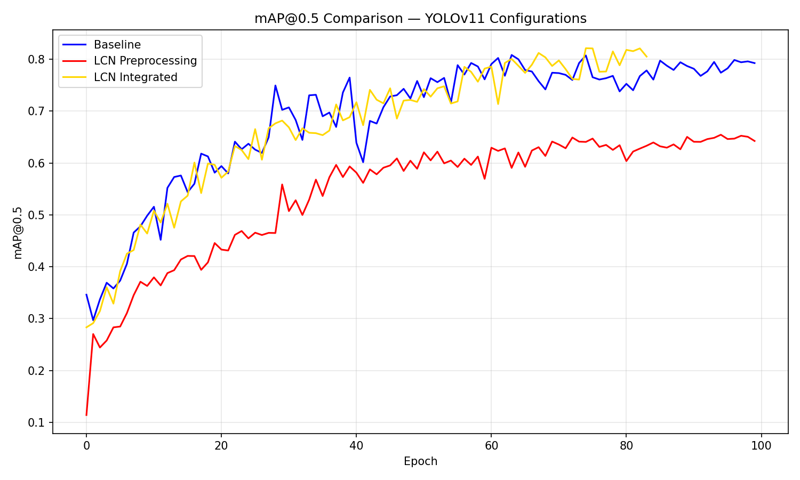
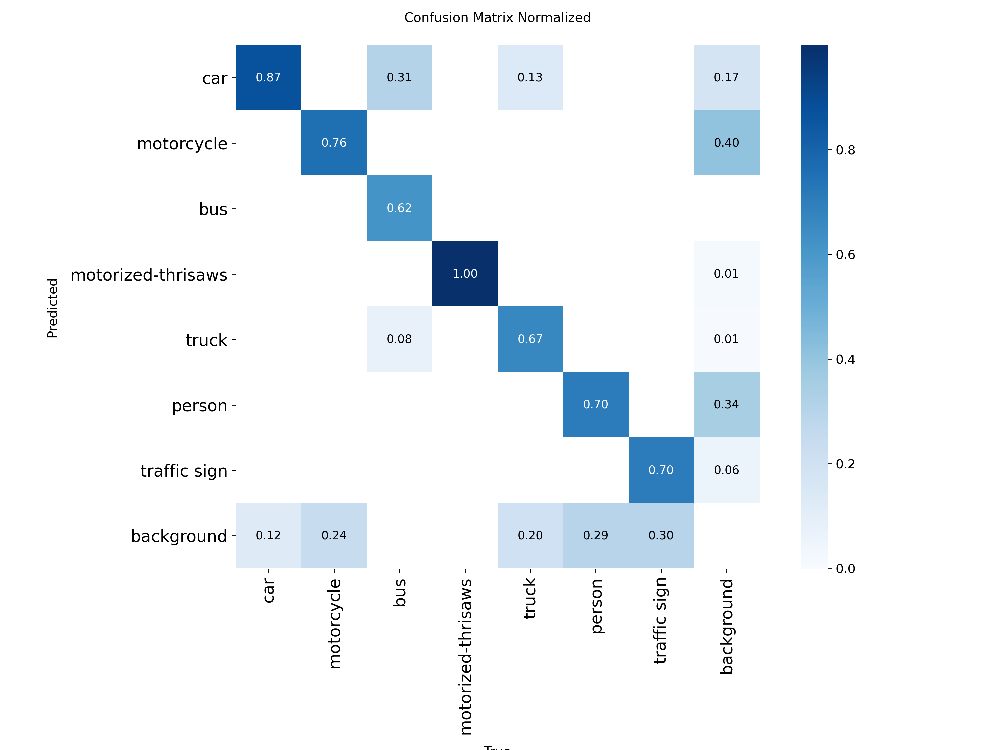

# YOLOv11 with Local Contrast Normalization for Low-light Traffic Detection

> Using Local Contrast Normalization integrated to YOLOv11 model
> Object detection model with low-light condition using Mixed Traffic dataset

[](https://www.python.org/downloads/)
[](https://pytorch.org/)
[](LICENSE)

## Overview

Standard YOLO models trained on Western datasets (COCO, ImageNet) struggle with mixed traffic due to:

- **Mixed vehicle types**: Cars, motorcycles, motorized-trishaw, bicycles, informal vehicles in same frame
- **Informal traffic patterns**: Lane-less driving, motorcycles weaving between vehicles
- **Variable lighting**: Harsh tropical sun, sudden monsoon darkness, minimal street lighting
- **Different infrastructure**: Unique signage, road markings, and urban layouts

**Research Question**: Can classical preprocessing techniques like Local Contrast Normalization (LCN) improve modern YOLOv11 architectures for mixed traffic detection?

## Results

| Configuration | mAP@0.5 | Precision | Recall |
|---|---|---|---|
| Baseline | 79.84% | 87.83% | 72.42% |
| LCN Preprocessing | 65.44% | 67.11% | 59.64% |
| LCN Integrated ✅ | 82.11% | 86.79% | 74.06% |





## Architecture
This project uses YOLOv11m as the base architecture. LCN is implemented as a custom PyTorch nn.Module and integrated directly into the model's forward pass, allowing the backbone to learn alongside the normalization layer during training.

## Dataset
See [dataset/README.md](dataset/README.md)

Dataset Characteristics

- **Size**: 2,000+ manually labeled images
- **Source**: Indonesian road traffic (Banda Aceh)
- **Vehicle classes**: Car, motorcycle, truck, bus, person, motorized-trishaw, traffic sign
- **Conditions**: 
  - Time: Dawn, evening, night
  - Weather: overcast, rain, heavy rain
  - Lighting: Natural, street lights, headlights, shadows

## Tech Stack
- **Python** 3.8+
- **PyTorch** 2.0+
- **Ultralytics** (YOLOv8-11 implementation)
- **OpenCV** (image processing)
- **NumPy**, **Pandas** (data manipulation)
- **Matplotlib**, **Seaborn** (visualization)
- **LabelImg** (annotation tool)
- **Google Colab** (training environment)

## How to Use

### Installation
```bash
# Clone repository
git clone https://github.com/Abassuci-Yusuf/yolov11-lcn-low-light-detection.git
cd yolov11-lcn-low-light-detection

# Install dependencies
pip install -r requirements.txt
```

### Training (Example)
```bash
# Train YOLOv11 baseline
yolo detect train data=mixed_traffic.yaml model=yolov10n.pt epochs=100 imgsz=640

# Evaluate model
yolo detect val model=models/yolov11_baseline.pt data=mixed_traffic.yaml
```

### Inference
```python
from ultralytics import YOLO

# Load trained model
model = YOLO('models/yolov11_baseline.pt')

# Run inference
results = model('path/to/traffic_image.jpg')
results[0].show()  # Display results
```
